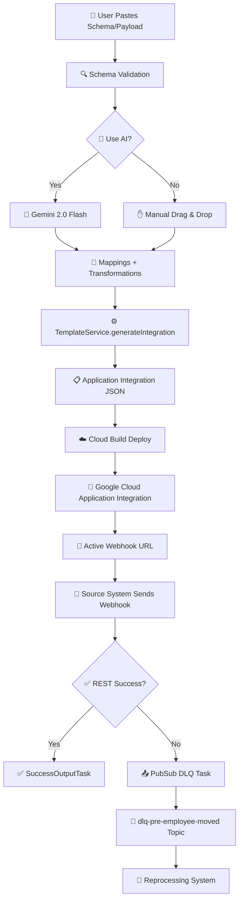

# Mapping Builder for Application Integration

## Not Google Product Clause
**⚠️ Disclaimer: This is not an officially supported Google product, nor is it part of any official Google product.**

A visual integration platform that serves as a customer-facing frontend for Google Cloud Application Integration. Enables clients to visually map payloads through a drag & drop interface and automatically generate deployable integrations.

📄 **[Documentação em Português](./docs/pt-BR/README.md)**

## 🏗️ Architecture

```
┌─────────────────┐    ┌─────────────────┐    ┌─────────────────┐
│   Frontend      │    │    Backend      │    │  Google Cloud   │
│   (React)       │◄──►│   (Node.js)     │◄──►│  Application    │
│                 │    │                 │    │  Integration    │
└─────────────────┘    └─────────────────┘    └─────────────────┘
```

### Components

- **Frontend**: React interface with drag & drop for visual mapping
- **Backend**: Node.js API for validation and deployment
- **Google Cloud**: Application Integration for runtime execution

## 🏗️ Detailed Architecture

### 📋 System Overview

The Mapping Builder implements a system-agnostic 3-layer architecture that transforms visual mappings into deployable Google Cloud Application Integration integrations:

```
┌─────────────────────────────────────────────────────────────────────────────┐
│                           PRESENTATION LAYER                                │
├─────────────────┬─────────────────┬─────────────────┬─────────────────────────┤
│   Schema Input  │  Mapping Canvas │  AI Assistant   │    JSON Preview         │
│   - JSON Parse  │  - Drag & Drop  │  - Gemini 2.0   │    - Integration JSON   │
│   - Validation  │  - Visual Links │  - Auto-detect  │    - Deploy Config      │
└─────────────────┴─────────────────┴─────────────────┴─────────────────────────┘
                                    │
┌─────────────────────────────────────────────────────────────────────────────┐
│                            BUSINESS LAYER                                   │
├─────────────────┬─────────────────┬─────────────────┬─────────────────────────┤
│ GeminiMapping   │ Transformation  │  Template       │    Integration          │
│ Service         │ Engine          │  Service        │    Service              │
│ - AI Mapping    │ - Data Transform│  - JSON Gen     │    - Orchestration      │
│ - Semantic      │ - Jsonnet       │  - PubSub DLQ   │    - Validation         │
│ - Recovery      │ - Preview       │  - Variables    │    - Deployment         │
└─────────────────┴─────────────────┴─────────────────┴─────────────────────────┘
                                    │
┌─────────────────────────────────────────────────────────────────────────────┐
│                         INFRASTRUCTURE LAYER                                │
├─────────────────┬─────────────────┬─────────────────┬─────────────────────────┤
│  Cloud Build    │ Application     │   PubSub DLQ    │   Cloud Monitoring      │
│  - CI/CD        │ Integration     │   - Fail Handle │   - Logs & Metrics      │
│  - Auto Deploy  │ - Runtime Exec  │   - Reprocessing│   - Error Tracking      │
└─────────────────┴─────────────────┴─────────────────┴─────────────────────────┘
```

### 🔄 Complete Flow: User Input → Deployed Application Integration



### 🧩 Detailed Components

#### 1. **GeminiMappingService** - AI-Powered Auto Detection

**Location**: `backend/src/services/GeminiMappingService.ts`

**Responsibility**: Automatically map fields between source and target systems using Gemini 2.0 Flash AI

**How It Works**:

```typescript
// Single-shot processing for 190+ fields
async generateMappings(clientSchema: any, inputType: 'schema' | 'payload', sourceSystemId: string = 'hr-system') {
  // 1. Load reference schemas
  const sourceSchema = await SchemaManagerService.loadSourceSchema(sourceSystemId);
  const sourceExamplePayload = await SchemaManagerService.loadSourceSystemExamplePayload(sourceSystemId);
  
  // 2. Build comprehensive prompt
  const prompt = this.buildComprehensivePrompt(sourceSchema, sourceExamplePayload, clientSchema, semanticPatterns);
  
  // 3. Single call to Gemini 2.0 Flash
  const response = await this.callGeminiAPI(prompt);
  
  // 4. Parse with robust recovery system
  const mappings = this.parseResponseWithRecovery(response);
  
  return mappings; // 27+ mappings with 86.3% average confidence
}
```

**Special Capabilities**:
- ✅ **Single-Shot Processing**: Processes 190+ fields in one call
- ✅ **Recovery System**: Defensive algorithm against truncated JSON
- ✅ **Adaptive Processing**: Smart batching for large payloads
- ✅ **Confidence Normalization**: Normalizes percentage values to decimals

#### 2. **TransformationEngine** - Data Transformation Logic

**Location**: `backend/src/services/TransformationEngine.ts`

**Responsibility**: Apply data transformations (CPF, phone, names, etc.)

**Transformation Architecture**:

```typescript
interface TransformationConfig {
  type: 'format_document' | 'phone_split' | 'name_split' | 'country_code' | 'normalize' | 'format_date';
  operation: string;
  pattern?: string;
  parameters?: any;
  preview?: { input: string; output: string; };
}

// Main engine with switch case for each type
static applyTransformation(value: any, transformation: TransformationConfig): any {
  switch (transformation.type) {
    case 'format_document':
      return this.formatDocument(value, transformation); // CPF: "269.622.778-06" → "26962277806"
    case 'phone_split':
      return this.splitPhone(value, transformation);     // "+5511999999999" → {area: "11", number: "999999999"}
    case 'name_split':
      return this.splitName(value, transformation);      // "João Silva" → "João"
    case 'country_code':
      return this.convertCountryCode(value, transformation); // "Brasil" → "BRA"
    default:
      return value;
  }
}
```

#### 3. **TemplateService** - Template Generation

**Location**: `backend/src/services/TemplateService.ts`

**Responsibility**: Generate complete Google Cloud Application Integration JSON

**How Templates Are Generated**:

```typescript
// Main method that orchestrates entire generation
static generateIntegration(config: IntegrationConfig): any {
  const integrationId = `int-${Date.now()}`;
  const triggerName = config.integrationName || integrationId;
  
  // 1. Generate main tasks
  const fieldMappingTask = this.generateFieldMappingTask(config.customerEmail);
  const restTask = this.generateRestTask();
  const pubsubTask = this.generatePubSubTask(); // ⭐ NEW: DLQ System
  const successTask = this.generateSuccessOutputTask();
  
  // 2. Generate transformation tasks (Jsonnet)
  const transformationTasks = config.mappings
    .filter(m => m.transformation)
    .map((mapping, index) => this.generateJsonnetMapperTask(mapping, index));
  
  // 3. Assemble final Application Integration JSON
  return {
    "name": `projects/160372229474/locations/us-central1/integrations/${integrationId}/versions/1`,
    "updateTime": new Date().toISOString(),
    "triggerConfigs": [{
      "label": "API Trigger",
      "triggerType": "API",
      "triggerId": `api_trigger/${triggerName}`, // ⭐ NEW: Clean Trigger ID
      "startTasks": [{ "taskId": "1" }]
    }],
    "taskConfigs": [
      fieldMappingTask,  // taskId: 1
      restTask,          // taskId: 2  
      successTask,       // taskId: 5
      pubsubTask,        // taskId: 4 ⭐ NEW: Replaces EmailTask
      ...transformationTasks // taskIds: 10+
    ],
    "integrationParameters": [...], // Input/Output schemas
    "integrationConfigParameters": [...] // CONFIG variables
  };
}
```

#### **Technical Specifications**


#### Universal APIs

```typescript
// ⭐ NEW: Agnostic endpoints serving any system
router.get('/source-schema/:systemId?', async (req, res) => {
  const systemId = req.params.systemId || 'hr-system';
  const schema = await SchemaManagerService.loadSourceSchema(systemId);
  // Works for: hr-system, salesforce, workday, sap, etc.
});

router.post('/generate-mappings', async (req, res) => {
  const { sourceSystemId = 'hr-system' } = req.body;
  const mappings = await geminiService.generateMappings(clientSchema, inputType, sourceSystemId);
  // AI maps any source system automatically
});
```

#### Universal Templates

```
templates/
└── universal/              # ⭐ NEW: Templates working with any system
    ├── tasks/
    │   └── pubsub-dlq-task.json
    └── transformations/
        ├── document-format.jsonnet    # Remove document formatting
        ├── name-split.jsonnet         # Split names
        ├── phone-split.jsonnet        # Split phones  
        └── country-code.jsonnet       # Convert country codes
```

#### Core System Files

```
backend/src/services/
├── GeminiMappingService.ts   # 🧠 AI + Mapping algorithms
├── TransformationEngine.ts   # ⚙️ Data transformation engine
├── TemplateService.ts        # 📋 Application Integration JSON generation
├── IntegrationService.ts     # 🎯 Complete orchestration
└── SchemaManagerService.ts   # 📁 Universal schema management
```

## 🚀 Features

- ✅ Visual drag & drop interface
- ✅ Source System → Target System payload mapping
- ✅ Automatic integration JSON generation
- ✅ Auto-deploy to Google Cloud Application Integration
- ✅ CI/CD pipeline with Cloud Build
- ✅ Execution monitoring and logs

## 📋 Prerequisites

- Node.js 18+
- Docker
- Google Cloud SDK
- Google Cloud account with Application Integration enabled

## 🛠️ Local Development

### Frontend

```bash
cd frontend
npm install
npm start
```

The application will be available at `http://localhost:3000`

### Backend

```bash
cd backend
npm install
npm run dev
```

The API will be available at `http://localhost:8080`

### Environment Variables

Create a `.env` file in the `backend` directory:

```env
NODE_ENV=development
PORT=8080
GOOGLE_CLOUD_PROJECT_ID=your-project-id
GOOGLE_CLOUD_REGION=us-central1
FRONTEND_URL=http://localhost:3000

# Gemini AI (optional - for automatic mapping)
GEMINI_API_KEY=your-gemini-api-key
```

### 🤖 Gemini AI Configuration (Optional)

To enable automatic mapping with AI:

1. **Get API Key**:
   - Access: https://makersuite.google.com/app/apikey
   - Create a new API key
   - Copy the generated key

2. **Configure in Backend**:
   ```bash
   cd backend
   echo "GEMINI_API_KEY=your-api-key-here" >> .env
   ```

3. **Features with Gemini**:
   - ✅ Automatic mapping based on semantics
   - ✅ Intelligent field suggestions
   - ✅ Naming pattern analysis
   - ✅ Fallback to simple algorithm if API fails

**Note**: Without the API key, the system uses a local semantic pattern-based mapping algorithm.

## 🐳 Docker

### Local Build

```bash
# Backend
docker build -t mapping-builder-backend ./backend

# Frontend
docker build -t mapping-builder-frontend ./frontend
```

### Docker Compose

```bash
docker-compose up -d
```

## ☁️ Deploy to Google Cloud

### 1. Configure Project

```bash
# Set project
export PROJECT_ID=your-project-id
gcloud config set project $PROJECT_ID

# Enable required APIs
gcloud services enable cloudbuild.googleapis.com
gcloud services enable run.googleapis.com
gcloud services enable integrations.googleapis.com
```

### 2. Deploy via Cloud Build

```bash
# Manual trigger
gcloud builds submit --config=deployment/cloudbuild.yaml

# Or configure automatic trigger
gcloud builds triggers create github \
  --repo-name=mapping-builder \
  --repo-owner=your-username \
  --branch-pattern="^main$" \
  --build-config=deployment/cloudbuild.yaml
```

### 3. Configure Permissions

```bash
# Service account for Application Integration
gcloud iam service-accounts create mapping-builder-integration \
  --display-name="Mapping Builder Integration Service Account"

# Add required roles
gcloud projects add-iam-policy-binding $PROJECT_ID \
  --member="serviceAccount:mapping-builder-integration@$PROJECT_ID.iam.gserviceaccount.com" \
  --role="roles/integrations.integrationAdmin"
```

## 📖 How to Use

### 1. Access the Interface

Navigate to the frontend URL deployed on Cloud Run.

### 2. Configure Integration

1. **Client Email**: Enter email for error notifications
2. **System Endpoint**: URL of the client system webhook

### 3. Map Fields

1. **Left Panel**: View source system payload structure
2. **Center Panel**: Drag fields to create mappings
3. **Right Panel**: Configure and view generated JSON

### 4. Deploy

Click "Deploy Integration" to create the integration in Google Cloud.


## 🔧 Project Structure (Updated)

```
mapping-builder/
├── frontend/                 # React frontend (optimized)
│   ├── src/
│   │   ├── components/      # Essential components
│   │   │   ├── ConfigPanel/     # Client configuration
│   │   │   ├── DebugPanel/      # Debug and monitoring  
│   │   │   ├── JsonPreview/     # Integration preview
│   │   │   ├── MappingCanvas/   # Main drag & drop interface
│   │   │   └── PayloadTree/     # Source system payload visualization
│   │   ├── types/          # TypeScript definitions
│   │   ├── utils/          # Core utilities
│   │   └── services/       # Frontend services
│   ├── Dockerfile
│   └── nginx.conf
├── backend/                 # Node.js backend
│   ├── src/
│   │   ├── routes/         # RESTful APIs
│   │   │   ├── deploy.ts       # Integration deployment
│   │   │   ├── gemini.ts       # AI mapping
│   │   │   ├── integration.ts  # Integration management
│   │   │   └── transformations.ts # Transformation preview
│   │   └── services/       # Business services
│   │       ├── CloudBuildService.ts     # Deploy automation
│   │       ├── GeminiMappingService.ts  # AI mapping
│   │       ├── IntegrationService.ts    # Integration generation
│   │       ├── SchemaManagerService.ts  # Schema management
│   │       ├── TemplateService.ts       # PubSub system
│   │       └── TransformationEngine.ts  # Transformation engine
│   └── Dockerfile
├── schemas/                # Schemas and examples
│   ├── source-systems/    # Source system schemas
│   ├── target-systems/    # Target system schemas
│   ├── examples/          # System examples
│   └── patterns/          # Semantic patterns
├── templates/             # Universal templates
│   ├── universal/         # System-agnostic templates
│   ├── source-systems/    # Source-specific templates
│   └── target-systems/    # Target-specific templates
├── deployment/            # Deploy configurations
│   ├── cloudbuild.yaml   # CI/CD pipeline
│   └── integration-build.yaml # Integration deploy
├── docs/                  # Documentation
│   ├── en/               # English documentation
│   └── pt-BR/            # Portuguese documentation
└── memory-bank/          # Technical documentation
    ├── activeContext.md   # Current state
    ├── progress.md        # Project progress
    └── systemPatterns.md  # Architectural patterns
```

## 🔄 Integration Flow

1. **Client configures** email and endpoint
2. **Client maps** Source System → Target System fields
3. **System generates** integration JSON
4. **Cloud Build** deploys to Application Integration
5. **Source system sends** webhook to integration
6. **Integration processes** and sends to client
7. **On error**, message is published to PubSub DLQ

## 📊 Monitoring

### Execution Logs

```bash
# Cloud Run logs
gcloud logging read "resource.type=cloud_run_revision" --limit=50

# Application Integration logs
gcloud logging read "resource.type=integration" --limit=50
```

### Metrics

- Executions per minute
- Success/error rate
- Average latency
- Resource usage

## 🛡️ Security

- ✅ Security headers configured
- ✅ Input validation with Joi
- ✅ Rate limiting
- ✅ CORS configured
- ✅ Non-root containers
- ✅ Health checks


