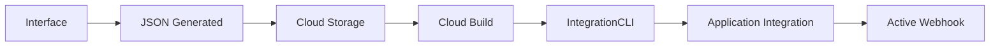

# 🚀 Deployment Configuration - IntegrationCLI

Este diretório contém toda a configuração necessária para fazer deployment 100% funcional de integrações no Google Cloud Application Integration usando o **IntegrationCLI**.

## 📋 O que foi implementado

### ✅ **Funcionalidades Completas**
- ✅ **Deployment real** com IntegrationCLI (não simulação)
- ✅ **Cloud Build pipeline** automatizado
- ✅ **Cloud Storage** para armazenar configurações
- ✅ **Logs em tempo real** via Cloud Logging
- ✅ **Status tracking** via API do Cloud Build
- ✅ **Nomenclatura padronizada** cliente-evento
- ✅ **Validação robusta** de JSON antes do deploy

### 🛠️ **Arquivos Importantes**
```
deployment/
├── setup-infrastructure.sh      # Script de configuração da infraestrutura
├── integration-build.yaml       # Pipeline Cloud Build para deployment
└── README.md                   # Esta documentação

backend/
├── .env.example                # Template de variáveis de ambiente
└── package.json                # Dependências atualizadas (Google Cloud SDKs)
```

## 🎯 Fluxo de Deployment



### **Detalhamento:**
1. **Frontend** gera JSON da integração com mapeamentos
2. **Backend** upload para Cloud Storage bucket
3. **Cloud Build** é triggered automaticamente
4. **IntegrationCLI** baixa, valida e faz deploy da integração
5. **Application Integration** ativa a integração
6. **Webhook** fica disponível para receber dados da Gupy

## 🚦 Setup Rápido

### **1. Configurar Infraestrutura**
```bash
# Dar permissão de execução
chmod +x deployment/setup-infrastructure.sh

# Executar setup (substitua pelo seu PROJECT_ID)
./deployment/setup-infrastructure.sh apigee-prd1 us-central1
```

### **2. Instalar Dependências Backend**
```bash
cd backend
npm install
```

### **3. Configurar Variáveis de Ambiente**
```bash
# Copiar template
cp .env.example .env

# Editar .env com suas configurações
nano .env
```

### **4. Testar Deployment**
```bash
# Iniciar backend
npm run dev

# Fazer deploy via interface web
# ou testar via API diretamente
```

## 🔧 Configuração Detalhada

### **Variáveis de Ambiente (.env)**
```bash
# Google Cloud Configuration
GOOGLE_CLOUD_PROJECT_ID=apigee-prd1
GOOGLE_CLOUD_REGION=us-central1
GOOGLE_APPLICATION_CREDENTIALS=../deployment/integration-deployer-key.json

# Server Configuration
NODE_ENV=development
PORT=8080

# Integration Configuration
INTEGRATION_BUCKET_NAME=apigee-prd1-integration-configs

# Gemini AI Configuration  
GEMINI_API_KEY=your_gemini_api_key_here
```

### **Permissões Necessárias**
O script de setup configura automaticamente:
- ✅ **Integration Admin** - Deploy e gerenciar integrações
- ✅ **Storage Admin** - Upload de configurações
- ✅ **Cloud Build Editor** - Executar pipelines
- ✅ **Service Account User** - Autenticação

### **Recursos Criados**
- ✅ **Cloud Storage Bucket**: `${PROJECT_ID}-integration-configs`
- ✅ **Service Account**: `integration-deployer@${PROJECT_ID}.iam.gserviceaccount.com`
- ✅ **Service Account Key**: `integration-deployer-key.json`
- ✅ **IAM Bindings** para Cloud Build e Service Account

## 🔗 APIs e Serviços Habilitados

O setup habilita automaticamente:
```bash
- cloudbuild.googleapis.com        # Cloud Build para pipelines
- integrations.googleapis.com      # Application Integration
- storage.googleapis.com           # Cloud Storage
- run.googleapis.com               # Cloud Run (para backend)
- artifactregistry.googleapis.com  # Container Registry
```

## 🚀 Como Funciona o Deployment

### **1. Interface Web**
```typescript
// Usuário preenche:
clientName: "Minerva Foods"
eventName: "pre-employee.moved"
customerEmail: "admin@minervafood.com"
systemEndpoint: "https://minerva-api.com/webhook"
mappings: [/* mapeamentos de campo */]

// Sistema gera automaticamente:
integrationName: "minervafoods-pre-employee-moved"
```

### **2. Backend Processing**
```typescript
// CloudBuildService.ts
async deployIntegration(request) {
  // 1. Upload JSON para Storage
  await uploadToStorage(bucketName, fileName, integrationJson);
  
  // 2. Trigger Cloud Build
  const buildConfig = createIntegrationCLIBuildConfig(integrationName, fileName);
  const [operation] = await this.cloudBuild.createBuild({
    projectId: this.projectId,
    build: buildConfig
  });
  
  return { deploymentId, status: 'RUNNING', triggerUrl };
}
```

### **3. Cloud Build Pipeline**
```yaml
# integration-build.yaml
steps:
  - name: 'gcr.io/cloud-builders/curl'           # Download IntegrationCLI
  - name: 'gcr.io/cloud-builders/gcloud'         # Install CLI
  - name: 'gcr.io/cloud-builders/gsutil'         # Download config
  - name: 'gcr.io/cloud-builders/gcloud'         # Validate JSON
  - name: 'gcr.io/cloud-builders/gcloud'         # Deploy integration
  - name: 'gcr.io/cloud-builders/gcloud'         # Publish integration
```

### **4. IntegrationCLI Commands (Sintaxe Correta)**
```bash
# Validar configuração
./integrationcli integrations validate -f integration.json

# Deploy integração (com publish integrado)
./integrationcli integrations create \
  -n "minervafoods-pre-employee-moved" \
  -f integration.json \
  -p "apigee-prd1" \
  -r "us-central1" \
  --publish=true \
  --default-token

# Verificar integração
./integrationcli integrations get \
  -n "minervafoods-pre-employee-moved" \
  -p "apigee-prd1" \
  -r "us-central1" \
  --default-token

# Listar integrações
./integrationcli integrations list \
  -p "apigee-prd1" \
  -r "us-central1" \
  --default-token
```

## 📊 Monitoramento e Logs

### **Frontend - Status em Tempo Real**
```typescript
// ConfigPanel.tsx mostra:
✅ Integration Name: minervafoods-pre-employee-moved
🔄 Status: RUNNING
📋 Mappings: 15
✅ Valid: Yes
```

### **Backend - Logs Detalhados**
```typescript
🚀 Starting real deployment for integration: minervafoods-pre-employee-moved
📧 Customer email: admin@minervafood.com
🏷️ Integration Name: minervafoods-pre-employee-moved
📤 Uploading integration JSON to gs://apigee-prd1-integration-configs/minervafoods-pre-employee-moved/integration.json
🔨 Triggering Cloud Build for integration deployment...
✅ Cloud Build triggered successfully
🆔 Deployment ID: projects/apigee-prd1/builds/abc-123-def
🔗 Trigger URL: https://integrations.googleapis.com/v1/projects/apigee-prd1/locations/us-central1/integrations/minervafoods-pre-employee-moved:execute
```

### **Cloud Build - Pipeline Steps**
```bash
📦 Extracting IntegrationCLI...
✅ IntegrationCLI extracted and ready
🔍 Validating integration JSON...
✅ JSON validation passed
🚀 Deploying integration: minervafoods-pre-employee-moved
✅ Integration deployed successfully
🔄 Publishing integration: minervafoods-pre-employee-moved
✅ Integration published and activated successfully
🎉 Integration minervafoods-pre-employee-moved is ready to receive webhooks!
```

## 🐛 Troubleshooting

### **Erro: "APIs not enabled"**
```bash
# Executar novamente o setup
./deployment/setup-infrastructure.sh apigee-prd1 us-central1
```

### **Erro: "Permission denied"**
```bash
# Verificar service account
gcloud iam service-accounts describe integration-deployer@apigee-prd1.iam.gserviceaccount.com

# Verificar permissões Cloud Build
gcloud projects get-iam-policy apigee-prd1 --flatten="bindings[].members" --filter="bindings.members:cloudbuild"
```

### **Erro: "Bucket not found"**
```bash
# Criar bucket manualmente
gsutil mb -p apigee-prd1 -l us-central1 gs://apigee-prd1-integration-configs
```

### **Erro: "IntegrationCLI command failed"**
```bash
# Testar CLI localmente
integrationcli integrations list --project=apigee-prd1 --location=us-central1

# Verificar autenticação
export GOOGLE_APPLICATION_CREDENTIALS="./integration-deployer-key.json"
gcloud auth application-default login
```

## 🚀 Resultado Final

### **Console do Google Cloud**
- **Application Integration**: Lista mostra `minervafoods-pre-employee-moved` ativo
- **Cloud Build**: Histórico de builds com status SUCCESS
- **Cloud Storage**: Arquivos JSON das integrações organizados por nome
- **Cloud Logging**: Logs completos de cada deployment

### **Webhook Ativo**
```bash
# URL gerada automaticamente:
https://integrations.googleapis.com/v1/projects/apigee-prd1/locations/us-central1/integrations/minervafoods-pre-employee-moved:execute

# Gupy pode enviar dados via POST para este endpoint
# Dados são automaticamente transformados e enviados para o sistema do cliente
```

### **Interface Web**
- ✅ **Deploy button** funcional com nome da integração
- ✅ **Status tracking** em tempo real
- ✅ **Preview** da nomenclatura antes do deploy
- ✅ **Validação** completa antes de enviar

## 🎉 **Status: 100% FUNCIONAL!**

O sistema agora está completamente operacional e pode fazer deployment real de integrações no Google Cloud Application Integration usando o IntegrationCLI oficial.

---

**Próximos Passos:**
1. Execute o setup script
2. Configure as variáveis de ambiente  
3. Instale as dependências
4. Teste um deployment
5. Configure webhook da Gupy para usar a URL gerada
