# Construtor de Mapeamento para Application Integration

**⚠️ Aviso: Este não é um produto oficialmente suportado pelo Google, nem faz parte de qualquer produto oficial do Google.**

Uma plataforma visual de integração que serve como fachada "customer face" para o Google Cloud Application Integration. Permite aos clientes mapear visualmente payloads através de uma interface drag & drop e gerar automaticamente integrações deployáveis.

🇺🇸 **[English Documentation](../../README.md)**

## 🏗️ Arquitetura

```
┌─────────────────┐    ┌─────────────────┐    ┌─────────────────┐
│   Frontend      │    │    Backend      │    │  Google Cloud   │
│   (React)       │◄──►│   (Node.js)     │◄──►│  Application    │
│                 │    │                 │    │  Integration    │
└─────────────────┘    └─────────────────┘    └─────────────────┘
```

### Componentes

- **Frontend**: Interface React com drag & drop para mapeamento visual
- **Backend**: API Node.js para validação e deployment
- **Google Cloud**: Application Integration para execução das integrações

## 🏗️ Arquitetura Detalhada

### 📋 Visão Geral do Sistema

O Construtor de Mapeamento implementa uma arquitetura system-agnostic em 3 camadas que transforma mapeamentos visuais em integrações Google Cloud Application Integration deployáveis:

```
┌─────────────────────────────────────────────────────────────────────────────┐
│                           CAMADA DE APRESENTAÇÃO                            │
├─────────────────┬─────────────────┬─────────────────┬─────────────────────────┤
│   Schema Input  │  Mapping Canvas │  AI Assistant   │    JSON Preview         │
│   - JSON Parse  │  - Drag & Drop  │  - Gemini 2.0   │    - Integration JSON   │
│   - Validation  │  - Visual Links │  - Auto-detect  │    - Deploy Config      │
└─────────────────┴─────────────────┴─────────────────┴─────────────────────────┘
                                    │
┌─────────────────────────────────────────────────────────────────────────────┐
│                            CAMADA DE NEGÓCIO                                │
├─────────────────┬─────────────────┬─────────────────┬─────────────────────────┤
│ GeminiMapping   │ Transformation  │  Template       │    Integration          │
│ Service         │ Engine          │  Service        │    Service              │
│ - IA Mapping    │ - Data Transform│  - JSON Gen     │    - Orchestration      │
│ - Semantic      │ - Jsonnet       │  - PubSub DLQ   │    - Validation         │
│ - Recovery      │ - Preview       │  - Variables    │    - Deployment         │
└─────────────────┴─────────────────┴─────────────────┴─────────────────────────┘
                                    │
┌─────────────────────────────────────────────────────────────────────────────┐
│                         CAMADA DE INFRAESTRUTURA                            │
├─────────────────┬─────────────────┬─────────────────┬─────────────────────────┤
│  Cloud Build    │ Application     │   PubSub DLQ    │   Cloud Monitoring      │
│  - CI/CD        │ Integration     │   - Fail Handle │   - Logs & Metrics      │
│  - Deploy Auto  │ - Runtime Exec  │   - Reprocessing│   - Error Tracking      │
└─────────────────┴─────────────────┴─────────────────┴─────────────────────────┘
```

### 🔄 Fluxo Completo: Input do Usuário → Application Integration Deployada

```mermaid
graph TD
    A[📝 Usuario Cola Schema/Payload] --> B[🔍 Schema Validation]
    B --> C{🤖 Usar IA?}
    
    C -->|Sim| D[🧠 Gemini 2.0 Flash]
    C -->|Não| E[✋ Manual Drag & Drop]
    
    D --> F[🎯 Mapeamentos + Transformações]
    E --> F
    
    F --> G[⚙️ TemplateService.generateIntegration]
    G --> H[📋 Application Integration JSON]
    
    H --> I[☁️ Cloud Build Deploy]
    I --> J[🚀 Google Cloud Application Integration]
    
    J --> K[🔗 Webhook URL Ativo]
    K --> L[📨 Sistema Origem Envia Webhook]
    
    L --> M{✅ REST Success?}
    M -->|Sim| N[✅ SuccessOutputTask]
    M -->|Não| O[📤 PubSub DLQ Task]
    
    O --> P[💾 dlq-pre-employee-moved Topic]
    P --> Q[🔄 Sistema Reprocessamento]
```



### 🧩 Componentes Detalhados

#### 1. **GeminiMappingService** - Detecção Automática IA

**Localização**: `backend/src/services/GeminiMappingService.ts`

**Responsabilidade**: Mapear automaticamente campos entre sistema origem e destino usando IA Gemini 2.0 Flash

**Como Funciona**:

```typescript
// Processamento Single-Shot para 190+ campos
async generateMappings(clientSchema: any, inputType: 'schema' | 'payload', sourceSystemId: string = 'hr-system') {
  // 1. Carregar schemas de referência
  const sourceSchema = await SchemaManagerService.loadSourceSchema(sourceSystemId);
  const sourceExamplePayload = await SchemaManagerService.loadSourceSystemExamplePayload(sourceSystemId);
  
  // 2. Construir prompt comprehensivo
  const prompt = this.buildComprehensivePrompt(sourceSchema, sourceExamplePayload, clientSchema, semanticPatterns);
  
  // 3. Chamada única para Gemini 2.0 Flash
  const response = await this.callGeminiAPI(prompt);
  
  // 4. Parse com sistema de recuperação robusto
  const mappings = this.parseResponseWithRecovery(response);
  
  return mappings; // 27+ mapeamentos com 86.3% confiança média
}
```

**Capacidades Especiais**:
- ✅ **Processamento Single-Shot**: Processa 190+ campos em uma chamada
- ✅ **Sistema de Recuperação**: Algoritmo defensivo contra JSON truncado
- ✅ **Processamento Adaptativo**: Lotes inteligentes para payloads grandes
- ✅ **Normalização Confidence**: Normaliza valores percentuais para decimais

#### 2. **TransformationEngine** - Lógica de Transformações

**Localização**: `backend/src/services/TransformationEngine.ts`

**Responsabilidade**: Aplicar transformações de dados (CPF, telefone, nomes, etc.)

**Arquitetura das Transformações**:

```typescript
interface TransformationConfig {
  type: 'format_document' | 'phone_split' | 'name_split' | 'country_code' | 'normalize' | 'format_date';
  operation: string;
  pattern?: string;
  parameters?: any;
  preview?: { input: string; output: string; };
}

// Engine principal com switch case para cada tipo
static applyTransformation(value: any, transformation: TransformationConfig): any {
  switch (transformation.type) {
    case 'format_document':
      return this.formatDocument(value, transformation); // CPF: "269.622.778-06" → "26962277806"
    case 'phone_split':
      return this.splitPhone(value, transformation);     // "+5511999999999" → {area: "11", number: "999999999"}
    case 'name_split':
      return this.splitName(value, transformation);      // "João Silva" → "João"
    case 'country_code':
      return this.convertCountryCode(value, transformation); // "Brasil" → "BRA"
    default:
      return value;
  }
}
```

#### 3. **TemplateService** - Geração de Templates

**Localização**: `backend/src/services/TemplateService.ts`

**Responsabilidade**: Gerar JSON completo do Google Cloud Application Integration

**Como Gera Templates**:

```typescript
// Método principal que orquestra toda a geração
static generateIntegration(config: IntegrationConfig): any {
  const integrationId = `int-${Date.now()}`;
  const triggerName = config.integrationName || integrationId;
  
  // 1. Gerar tasks principais
  const fieldMappingTask = this.generateFieldMappingTask(config.customerEmail);
  const restTask = this.generateRestTask();
  const pubsubTask = this.generatePubSubTask(); // ⭐ NOVO: Sistema DLQ
  const successTask = this.generateSuccessOutputTask();
  
  // 2. Gerar tasks de transformação (Jsonnet)
  const transformationTasks = config.mappings
    .filter(m => m.transformation)
    .map((mapping, index) => this.generateJsonnetMapperTask(mapping, index));
  
  // 3. Montar JSON final do Application Integration
  return {
    "name": `projects/160372229474/locations/us-central1/integrations/${integrationId}/versions/1`,
    "updateTime": new Date().toISOString(),
    "triggerConfigs": [{
      "label": "API Trigger",
      "triggerType": "API",
      "triggerId": `api_trigger/${triggerName}`, // ⭐ NOVO: Trigger ID limpo
      "startTasks": [{ "taskId": "1" }]
    }],
    "taskConfigs": [
      fieldMappingTask,  // taskId: 1
      restTask,          // taskId: 2  
      successTask,       // taskId: 5
      pubsubTask,        // taskId: 4 ⭐ NOVO: Substitui EmailTask
      ...transformationTasks // taskIds: 10+
    ],
    "integrationParameters": [...], // Schemas Input/Output
    "integrationConfigParameters": [...] // Variáveis CONFIG
  };
}
```

### 🔄 **Sistema PubSub Dead Letter Queue (DLQ)** ⭐ **FUNCIONALIDADE CRÍTICA IMPLEMENTADA**

#### **Contexto Business e Necessidade**
Substituímos o sistema EmailTask tradicional por uma solução PubSub Dead Letter Queue para tratamento robusto de falhas de integração. Esta mudança resolve limitações críticas de escalabilidade e configuração.

#### **Problemas EmailTask Resolvidos**
- **❌ Dependência email corporativa**: Configuração SMTP complexa específica por cliente
- **❌ Limitações escalabilidade**: Emails não são ideais para processamento em lote
- **❌ Problemas variáveis dinâmicas**: Contexto de erro corrompia variáveis de email
- **❌ Sem reprocessamento**: Emails não permitem retry automático

#### **Solução PubSub Implementada**
- **✅ Assíncrono por design**: Processamento batch, retry automático e load balancing
- **✅ Infraestrutura existente**: Reutiliza connection PubSub já configurada
- **✅ Monitoramento avançado**: Métricas, alertas e tracking de mensagens
- **✅ Payload preservado**: SystemPayload original mantido para reprocessamento

#### **Arquitetura do Sistema DLQ**

```
Webhook Sistema Origem → FieldMappingTask → RestTask (Cliente)
                                      ↓ (falha)
                               PubSubTask (DLQ)
                                      ↓
                          Topic: "dlq-pre-employee-moved"
                                      ↓
                            Sistema de Reprocessamento
```

#### **Especificações Técnicas**

**Connection PubSub**:
```
projects/apigee-prd1/locations/us-central1/connections/pubsub-poc
```

**Topic DLQ**:
```
dlq-pre-employee-moved
```

**Payload DLQ**: SystemPayload completo convertido para JSON string usando função nativa `TO_JSON`

**Schemas Definidos**:
- **Input Schema**: `{message: string, topic: string, attributes?: string}`
- **Output Schema**: `{messageId: string}` para tracking

### 🌐 Sistema Universal System-Agnostic


#### APIs Universais

```typescript
// ⭐ NOVO: Endpoints agnósticos que servem qualquer sistema
router.get('/source-schema/:systemId?', async (req, res) => {
  const systemId = req.params.systemId || 'hr-system';
  const schema = await SchemaManagerService.loadSourceSchema(systemId);
  // Funciona para: hr-system, salesforce, workday, sap, etc.
});

router.post('/generate-mappings', async (req, res) => {
  const { sourceSystemId = 'hr-system' } = req.body;
  const mappings = await geminiService.generateMappings(clientSchema, inputType, sourceSystemId);
  // IA mapeia qualquer sistema origem automaticamente
});
```

#### Templates Universais

```
templates/
└── universal/              # ⭐ NOVO: Templates que funcionam com qualquer sistema
    ├── tasks/
    │   └── pubsub-dlq-task.json
    └── transformations/
        ├── document-format.jsonnet    # Remove formatação documentos
        ├── name-split.jsonnet         # Divide nomes
        ├── phone-split.jsonnet        # Divide telefones  
        └── country-code.jsonnet       # Converte códigos país
```

### 📊 Métricas e Performance

#### Capacidades Atuais
- **Processamento IA**: Single-shot para 190+ campos em <5 segundos
- **Geração JSON**: Integração completa em <2 segundos
- **Pipeline Deploy**: Mapeamento → Live em <5 minutos
- **Confiança IA**: 86.3% média com Gemini 2.0 Flash
- **Cobertura**: 27+ mapeamentos automáticos típicos

#### Evidências de Funcionalidade
- ✅ **Sistema 100% Funcional**: Zero erros críticos conhecidos
- ✅ **Pipeline Deploy**: Integração criada → publicada → LIVE automaticamente  
- ✅ **PubSub DLQ**: Sistema robusto de tratamento de falhas implementado
- ✅ **System-Agnostic**: Arquitetura universal para qualquer sistema origem
- ✅ **Confidence Fix**: Normalização implementada resolve erro deployment

#### Arquivos Core do Sistema

```
backend/src/services/
├── GeminiMappingService.ts   # 🧠 IA + Algoritmos de mapeamento
├── TransformationEngine.ts   # ⚙️ Engine de transformação de dados
├── TemplateService.ts        # 📋 Geração JSON Application Integration
├── IntegrationService.ts     # 🎯 Orquestração completa
└── SchemaManagerService.ts   # 📁 Gestão schemas universal
```

## 🚀 Funcionalidades

- ✅ Interface visual drag & drop
- ✅ Mapeamento de payload Sistema Origem → Sistema Destino
- ✅ **Sistema PubSub DLQ para tratamento robusto de falhas** ⭐ **NOVO**
- ✅ Geração automática de JSON de integração
- ✅ Deploy automático no Google Cloud Application Integration
- ✅ Pipeline CI/CD com Cloud Build
- ✅ Monitoramento e logs de execução

## 📋 Pré-requisitos

- Node.js 18+
- Docker
- Google Cloud SDK
- Conta Google Cloud com Application Integration habilitado

## 🛠️ Desenvolvimento Local

### Frontend

```bash
cd frontend
npm install
npm start
```

A aplicação estará disponível em `http://localhost:3000`

### Backend

```bash
cd backend
npm install
npm run dev
```

A API estará disponível em `http://localhost:8080`

### Variáveis de Ambiente

Crie um arquivo `.env` no diretório `backend`:

```env
NODE_ENV=development
PORT=8080
GOOGLE_CLOUD_PROJECT_ID=seu-project-id
GOOGLE_CLOUD_REGION=us-central1
FRONTEND_URL=http://localhost:3000

# Gemini AI (opcional - para mapeamento automático)
GEMINI_API_KEY=sua-api-key-do-gemini
```

### 🤖 Configuração do Gemini AI (Opcional)

Para habilitar o mapeamento automático com IA:

1. **Obter API Key**:
   - Acesse: https://makersuite.google.com/app/apikey
   - Crie uma nova API key
   - Copie a chave gerada

2. **Configurar no Backend**:
   ```bash
   cd backend
   echo "GEMINI_API_KEY=sua-api-key-aqui" >> .env
   ```

3. **Funcionalidades com Gemini**:
   - ✅ Mapeamento automático baseado em semântica
   - ✅ Sugestões inteligentes de campos
   - ✅ Análise de padrões de nomenclatura
   - ✅ Fallback para algoritmo simples se API falhar

**Nota**: Sem a API key, o sistema usa um algoritmo de mapeamento baseado em padrões semânticos locais.

## 🐳 Docker

### Build Local

```bash
# Backend
docker build -t mapping-builder-backend ./backend

# Frontend
docker build -t mapping-builder-frontend ./frontend
```

### Docker Compose

```bash
docker-compose up -d
```

## ☁️ Deploy no Google Cloud

### 1. Configurar Projeto

```bash
# Definir projeto
export PROJECT_ID=seu-project-id
gcloud config set project $PROJECT_ID

# Habilitar APIs necessárias
gcloud services enable cloudbuild.googleapis.com
gcloud services enable run.googleapis.com
gcloud services enable integrations.googleapis.com
```

### 2. Deploy via Cloud Build

```bash
# Trigger manual
gcloud builds submit --config=deployment/cloudbuild.yaml

# Ou configurar trigger automático
gcloud builds triggers create github \
  --repo-name=mapping-builder \
  --repo-owner=seu-usuario \
  --branch-pattern="^main$" \
  --build-config=deployment/cloudbuild.yaml
```

### 3. Configurar Permissões

```bash
# Service account para Application Integration
gcloud iam service-accounts create mapping-builder-integration \
  --display-name="Mapping Builder Integration Service Account"

# Adicionar roles necessários
gcloud projects add-iam-policy-binding $PROJECT_ID \
  --member="serviceAccount:mapping-builder-integration@$PROJECT_ID.iam.gserviceaccount.com" \
  --role="roles/integrations.integrationAdmin"
```

## 📖 Como Usar

### 1. Acessar a Interface

Navegue até a URL do frontend deployado no Cloud Run.

### 2. Configurar Integração

1. **Email do Cliente**: Insira o email para notificações de erro
2. **Endpoint do Sistema**: URL do webhook do sistema cliente

### 3. Mapear Campos

1. **Painel Esquerdo**: Visualize a estrutura do payload do sistema origem
2. **Painel Central**: Arraste campos para criar mapeamentos
3. **Painel Direito**: Configure e visualize o JSON gerado

### 4. Deploy

Clique em "Deploy Integration" para criar a integração no Google Cloud.

## 🧹 **LIMPEZA DE CÓDIGO RECÉM-IMPLEMENTADA** (Agosto 2025)

### ✅ **Código Otimizado e Simplificado**
O projeto passou por uma limpeza abrangente para remover código não utilizado:

- **22 arquivos/pastas removidos** (~25% redução no tamanho)
- **Interface simplificada** sem componentes Wizard desnecessários
- **Build otimizado** para 164.01 kB (bundle final)
- **Código mais limpo** focado apenas no essencial

### 📁 **Arquivos Removidos**
- ❌ Arquivos de teste manuais obsoletos (6 arquivos)
- ❌ Schemas duplicados e documentação redundante
- ❌ Templates Jsonnet obsoletos (pasta completa)
- ❌ Componentes Wizard não utilizados (2 pastas completas)
- ❌ Templates integration obsoletos

### 🎯 **Interface Otimizada**
- **Schema Input Direto**: Input JSON simplificado no MappingCanvas
- **Drag & Drop Core**: Foco na funcionalidade principal
- **Zero Dependências Mortas**: Código 100% utilizado

## 🔧 Estrutura do Projeto (Atualizada)

```
mapping-builder/
├── frontend/                 # React frontend (otimizado)
│   ├── src/
│   │   ├── components/      # Componentes essenciais
│   │   │   ├── ConfigPanel/     # Configuração cliente
│   │   │   ├── DebugPanel/      # Debug e monitoramento  
│   │   │   ├── JsonPreview/     # Preview integração
│   │   │   ├── MappingCanvas/   # Interface principal drag & drop
│   │   │   └── PayloadTree/     # Visualização payload sistema origem
│   │   ├── types/          # Definições TypeScript
│   │   ├── utils/          # Utilitários core
│   │   └── services/       # Serviços frontend
│   ├── Dockerfile
│   └── nginx.conf
├── backend/                 # Node.js backend
│   ├── src/
│   │   ├── routes/         # APIs RESTful
│   │   │   ├── deploy.ts       # Deploy integração
│   │   │   ├── gemini.ts       # Mapeamento IA
│   │   │   ├── integration.ts  # Gestão integração
│   │   │   └── transformations.ts # Preview transformação
│   │   └── services/       # Serviços de negócio
│   │       ├── CloudBuildService.ts     # Automação deploy
│   │       ├── GeminiMappingService.ts  # IA mapeamento
│   │       ├── IntegrationService.ts    # Geração integração
│   │       ├── SchemaManagerService.ts  # Gestão schemas
│   │       ├── TemplateService.ts       # Sistema PubSub
│   │       └── TransformationEngine.ts  # Engine transformação
│   └── Dockerfile
├── schemas/                # Schemas e exemplos
│   ├── source-systems/    # Schemas sistema origem
│   ├── target-systems/    # Schemas sistema destino
│   ├── examples/          # Exemplos sistemas
│   └── patterns/          # Padrões semânticos
├── templates/             # Templates universais
│   ├── universal/         # Templates system-agnostic
│   ├── source-systems/    # Templates específicos origem
│   └── target-systems/    # Templates específicos destino
├── deployment/            # Configurações deploy
│   ├── cloudbuild.yaml   # Pipeline CI/CD
│   └── integration-build.yaml # Deploy integração
├── docs/                  # Documentação
│   ├── en/               # Documentação inglês
│   └── pt-BR/            # Documentação português
└── memory-bank/          # Documentação técnica
    ├── activeContext.md   # Estado atual
    ├── progress.md        # Progresso projeto
    └── systemPatterns.md  # Padrões arquiteturais
```

## 🔄 Fluxo de Integração

1. **Cliente configura** email e endpoint
2. **Cliente mapeia** campos Sistema Origem → Sistema Destino
3. **Sistema gera** JSON de integração
4. **Cloud Build** deploya no Application Integration
5. **Sistema origem envia** webhook para integração
6. **Integração processa** e envia para cliente
7. **Em caso de erro**, mensagem é publicada no PubSub DLQ

## 📊 Monitoramento

### Logs de Execução

```bash
# Logs do Cloud Run
gcloud logging read "resource.type=cloud_run_revision" --limit=50

# Logs do Application Integration
gcloud logging read "resource.type=integration" --limit=50
```

### Métricas

- Execuções por minuto
- Taxa de sucesso/erro
- Latência média
- Uso de recursos

## 🛡️ Segurança

- ✅ Headers de segurança configurados
- ✅ Validação de entrada com Joi
- ✅ Rate limiting
- ✅ CORS configurado
- ✅ Containers não-root
- ✅ Health checks

## 🤝 Contribuição

1. Fork o projeto
2. Crie uma branch (`git checkout -b feature/nova-funcionalidade`)
3. Commit suas mudanças (`git commit -am 'Adiciona nova funcionalidade'`)
4. Push para a branch (`git push origin feature/nova-funcionalidade`)
5. Abra um Pull Request

## 📝 Licença

Este projeto está sob a licença MIT. Veja o arquivo [LICENSE](../../LICENSE) para detalhes.

## 🆘 Suporte

Para suporte, abra uma issue no GitHub ou entre em contato com a equipe de desenvolvimento.

---

**Desenvolvido com ❤️ para facilitar integrações no Google Cloud**
